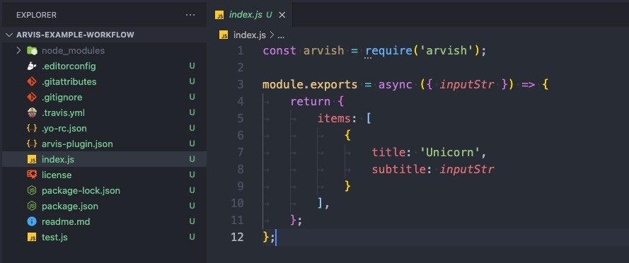

# generator-arvis

> Scaffold out an [Arvis](https://github.com/jopemachine/arvis) extension

This module is inspired and clone by [generator-alfred](https://github.com/SamVerschueren/generator-alfred)

Example:


Example result:



## Install

```
$ npm install --global generator-arvis
```


## Usage

With [yo](https://github.com/yeoman/yo):

```
$ yo arvis
```
