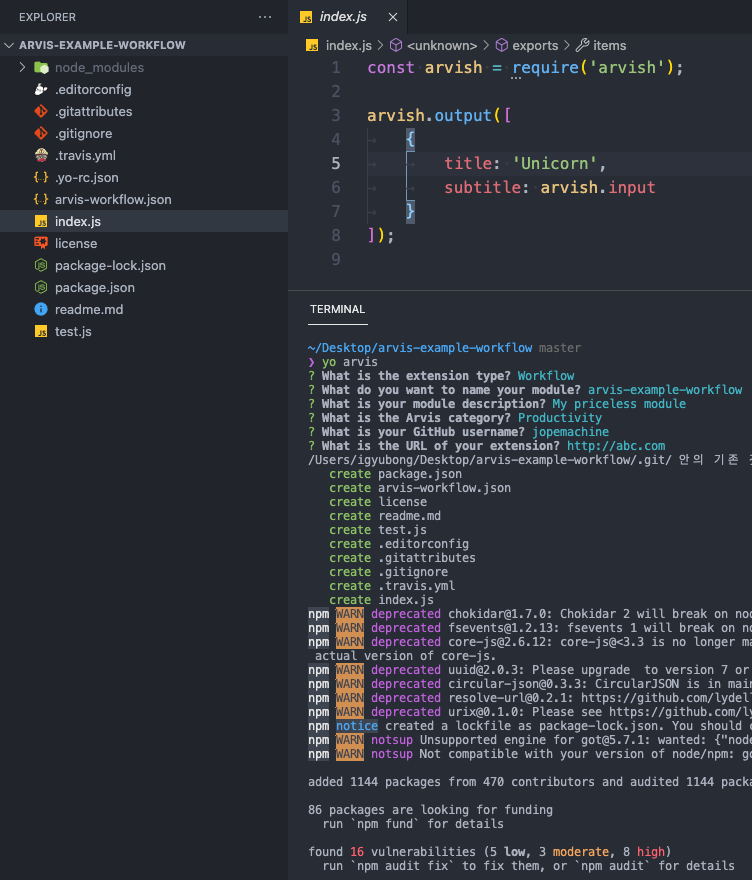

# generator-arvis

[](http://badge.fury.io/js/generator-arvis)
[](http://badge.fury.io/js/generator-arvis)
[](https://lbesson.mit-license.org/)
[](http://makeapullrequest.com)
[](https://GitHub.com/jopemachine/arvish/issues/)

> Scaffold out an [Arvis](https://github.com/jopemachine/arvis) extension

This module is inspired and clone by [generator-alfred](https://github.com/SamVerschueren/generator-alfred)

Demo:



## Install

```
$ npm install --global generator-arvis
```


## Usage

With [yo](https://github.com/yeoman/yo):

```
$ yo arvis
```
